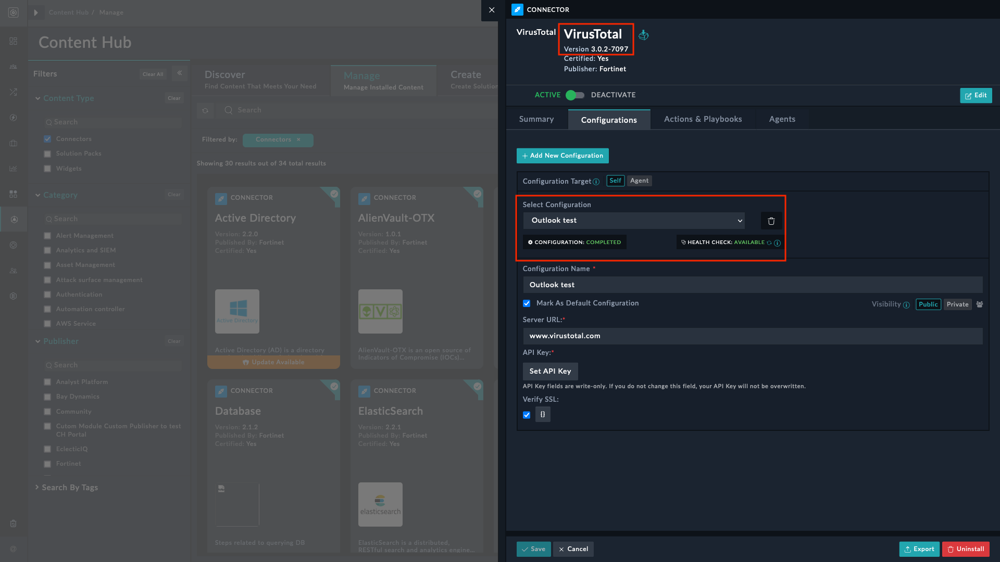
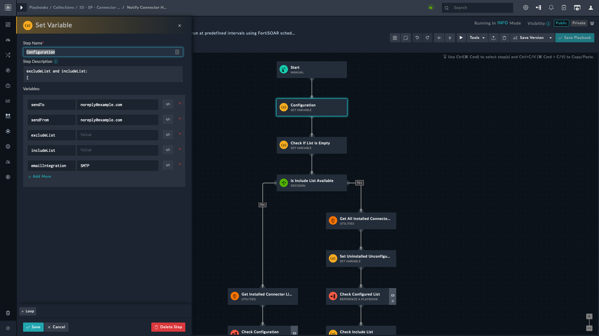
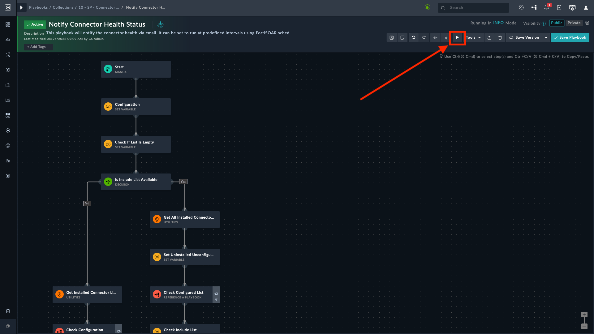
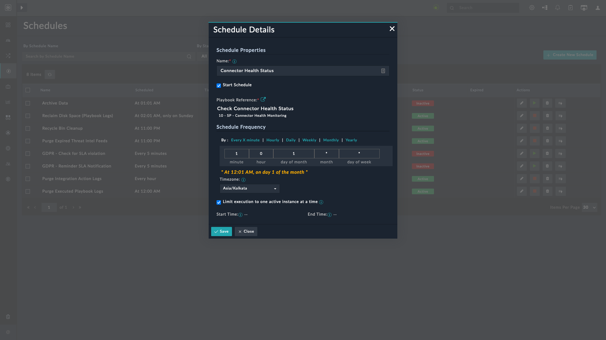

| [Home](https://github.com/fortinet-fortisoar/solution-pack-connector-health-monitoring/blob/release/1.0.0/README.md) |
|----------------------------------------------------------------------------------------------------------------------|

# Usage

The Connector Health Monitoring solution pack notifies users of specified connectors' health. The recipients receive all connectors' statuses in a tabular form, detailing each version and configuration available for the listed connectors. The solution pack reports the connectors' health based on an *Include* and *Exclude* list.

Subsequent sections describe the format in which to declare the Exclude and Include list, retrieving connector details, playbook configurations required before usage, and the output or notification email format to expect.

After you have configured the playbooks, you can either run the playbook, [manually](./usage.md#manual-execution), or [create a schedule](./usage.md#scheduled-execution) for the playbook to be executed at regular intervals.

## Include and Exclude List Format

Following is the format in which to specify the exclude and include list of connectors. Each connector is listed as an object, separated by a comma in an array.

```JSON
[
  {
    "name": "",
    "version": "",
    "configName": []
  }
]
```

For example, following snippet shows how to declare multiple connectors for exclude or include list:

```JSON
[
  {
    "name": "VirusTotal",
    "version": "3.0.0",
    "configName": [ "vt-1" ]
  },
  {
    "name": "Exchange",
    "version": "4.0.0",
    "configName": [ "demo-1" ]
  }
]
```

| Field Type | Key Value Pair                         | Description                                                                                                                                                           |
|:-----------|:---------------------------------------|:----------------------------------------------------------------------------------------------------------------------------------------------------------------------|
| **string** | `"name": "ConnectorName"`              | This field contains connector's name, for example, `VirusTotal`. This is a *mandatory* field. If left blank, the connector appears under **Invalid** when specified under *Include* list and ignored when specified in *Exclude* list. |
| **string** | `"version": "VersionNumber"`           | This field contains connector's installed version, for example, `1.0.0`. This is an *optional* field. If left blank, it fetches status of all available versions                                                                               |
| **array**  | `"configName": ["config1", "config2"]` | This field contains available connector's configurations, for example, `config1`. This is an *optional* field. If left blank, it fetches status of all available configurations.                                                                        |

## Retrieve Connector Details

Connector details like their name, version, and available configurations are required to specify the include and exclude list in the format explained in the previous section.

There are two methods to retrieve connector details:
1. Using the application's user interface
    1. Click **Content Hub**.
    2. Select the **Manage** tab.
    3. Search for and select the connector to view its details.
    4. Copy the name, version, and configuration name.

    

2. Using the API. For more information, refer to [FortiSOAR connector API guide](https://docs.fortinet.com/document/fortisoar/7.2.1/api-guide/267041/api-methods#Integration_APIs)

 
## Configuring the Playbooks

By default, the Connector Health Monitoring works with the configuration shown in the following image.



To make changes:
1. Navigate to **Automation** > **Playbooks**.
2. Click the **10 - SP - 	Connector Health Monitoring** playbook collection.
3. Double-click to open the playbook **Notify Connector Health Status**.
4. Double-click to open the *Configuration* step of **Notify Connector Health Status** playbook.

    | Field Name         | Description                                                                                                                                                                              |
    |:-------------------|:-----------------------------------------------------------------------------------------------------------------------------------------------------------------------------------------|
    | `sendTo`           | contains the email address of the intended recipients. To send emails to multiple users separate each email address with a comma. For example, `noreply@example.com`, `demo@example.com` |
    | `sendFrom`         | contains the sender's email address. It accepts only one email address from which the recipients receive the email                                                                       |
    | `excludeList`      | contains the list of connectors that are to be *excluded* from the connector health status report.                                                                                       |
    | `includeList`      | contains the list of connectors that are to be *included* in the connector health status report                                                                                          |
    | `emailIntegration` | can either be `SMTP` or `Exchange`. It is the email server type that is used for sending the email to the specified email recipients                                                     |

    >**NOTE**:  Refer to the section [Exlude and Include List Format](./usage.md#include-and-exclude-list-format) to know the format for specifying the exclude and include lists.

## Running the Playbooks

This section explains how to get the connector health using the Connector Health Monitoring Solution pack.

### Manual Trigger

You can manually trigger the playbook thereby controlling how and when the notification emails are sent. To manually trigger the playbook:

1. Navigate to **Automation** > **Playbooks**.
2. Click the **10 - SP - 	Connector Health Monitoring** playbook collection.
3. Double-click to open the playbook **Notify Connector Health Status**.
4. Click the play button on the upper right corner to trigger the playbook.

    

Once the playbook execution completes, you receive an email with connector health status.

### Scheduled Trigger

You can schedule the trigger for the playbook to avoid running the playbook every time you want to check the connector health status. To schedule the playbook's trigger:

1. Navigate to **Automation** > **Schedules** from the left navigation bar..
2. Click the button **+ Create New Schedule**.

    

Refer to [Working with Schedules](https://docs.fortinet.com/document/fortisoar/7.2.2/user-guide/915083/schedules#Working_with_Schedules) to schedule playbooks to run at regular intervals. 

## Output

This section explains the various circumstances under which the output or the email sent to the recipients varies. It also discusses various scenarios within these circumstances.

1. Both the exclude and include lists are empty
2. Only exclude list is specified
3. Only include list is specified
4. Both the exclude and include lists are specified

### Empty Exclude and Include Lists

If both the exclude and include lists are empty, the email displays the health status of all connected and disconnected connectors.

### Only Exclude List Specified

This section explains the scenarios where certain parameters may be missing or unspecified in the exclude list.

#### Connector `name` Specified

Consider the following snippet. In the exclude list, only the name is provided.

```JSON
[
  {
    "name": "VirusTotal",
    "version": "",
    "configName": []
  }
]
```

In such a case, the notification email excludes the specified connector with all its versions and configurations. So, all configurations and versions of *Virus Total* are excluded.

#### Connector `name` and `version` specified

Consider the following snippet. In the exclude list, only the name and version is provided, but not the configuration name (`configName`).

```JSON
[
  {
    "name": "VirusTotal",
    "version": "3.0.0",
    "configName": []
  }
]
```

In such a case, the notification email excludes the specified connector, its mentioned version and all configurations. So, all configurations of *Virus Total* version *3.0.0* are excluded.

#### Connector `name` and `configName` specified

Consider the following snippet. In the exclude list, only the name and configuration name (`configName`) is provided, but not the version.

```JSON
[
  {
    "name": "VirusTotal",
    "version": "",
    "configName": ["vt-1", "vt-2" ]
  }
]
```

In such a case, the notification email excludes the specified connector, its mentioned configuration and all versions. So, all versions of *Virus Total* and its configurations &mdash; `vt-1` and `vt-2` &mdash; are excluded.

#### All Parameters Specified

Consider the following snippet. In the exclude list, all the parameters are specified.

```JSON
[
  {
    "name": "VirusTotal",
    "version": "",
    "configName": [ "vt-1, "vt-2" ]
  }
]
```

Only the specified connector, with the specified version, and mentioned configuration is excluded.

### Only Include List Specified

This section explains the scenarios where certain parameters may be missing or unspecified in the include list.

#### Connector `name` Specified

Consider the following snippet. In the include list, only the name is provided.

```JSON
[
  {
    "name": "VirusTotal",
    "version": "",
    "configName": []
  }
]
```

In such a case, the notification email displays the health status of the specified connector(VirusTotal) with all its versions and configurations.

>**WARNING**: If there is a typo in the connector's name or the connector is not installed, the connector appears in the **Invalid Include List** table as **Connector Not Present**.

#### Connector `name` and `version` specified

Consider the following snippet. In the include list, only the name and version is provided, but not the configuration name (`configName`).

```JSON
[
  {
    "name": "VirusTotal",
    "version": "3.0.0",
    "configName": []
  }
]
```

In such a case, the notification email displays the health status of the specified connector(`VirusTotal`), its mentioned version(`3.0.0`) and all its configurations.

>**WARNING**: If the connector's version is incorrect or the specified version is not configured, the connector appears in the **Invalid Include List** table as **Connector Not Present**.

#### Connector `name` and `configName` specified

Consider the following snippet. In the include list, only the name and configuration name (`configName`) is provided, but not the version.

```JSON
[
  {
    "name": "VirusTotal",
    "version": "",
    "configName": ["vt-1", "vt-2" ]
  }
]
```

In such a case, the notification email displays the health status of the specified connector(`VirusTotal`), its mentioned configuration(`vt-1` and `vt-2`) and all its versions.

>**WARNING**: If the connector's version is incorrect, the connector appears in the **Invalid Include List** table as **Connector Not Present**.

#### All Parameters Specified

Consider the following snippet. In the include list, all the parameters are specified.

```JSON
[
  {
    "name": "VirusTotal",
    "version": "3.0.0",
    "configName": [ "vt-1, "vt-2" ]
  }
]
```

In such a case, the notification email displays the health status of the specified connector(`VirusTotal`), its specified version(`3.0.0`), and its mentioned configuration(`vt-1` and `vt-2`).

>**NOTE**: If the same connector appears in both include and exclude lists, the priority is given to the include list.