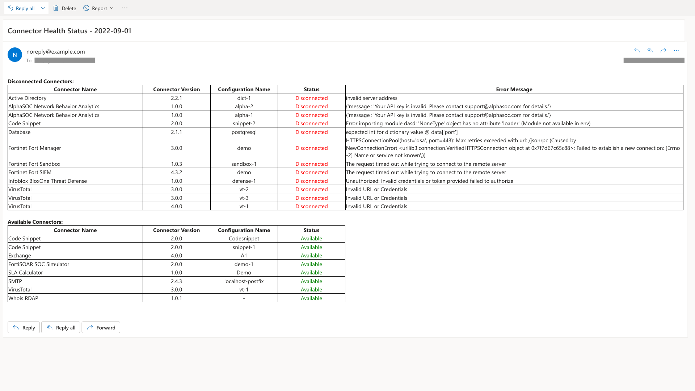

| [Home](https://github.com/fortinet-fortisoar/solution-pack-connector-health-monitoring/blob/release/1.0.0/README.md) |
|----------------------------------------------------------------------------------------------------------------------|

# Usage

The Connector Health Monitoring solution pack notifies users of specified connectors' health via email. The recipients receive all connectors' statuses in a tabular form, detailing each version and configuration available for the installed connectors. The solution pack reports the connectors' health based on an *Include* and *Exclude* list.

Subsequent sections describe the format in which to declare the Include or Exclude list, retrieving connector details, playbook configurations required before usage, and the output or notification email format to expect.

This solution pack also creates a schedule **Notify Connector Health Status** in **Automation** > **Schedules**.

After you have [configured the playbooks](./usage.md#configuring-the-playbooks), you can customize the created schedule to your requirements and then activate when you are ready to send periodic notifications. Refer to [Working with Schedules](https://docs.fortinet.com/document/fortisoar/7.2.2/user-guide/915083/schedules#Working_with_Schedules) to customize the schedule when playbooks run. 

You can monitor all the configured connectors using an exclude or an include list. However, it is recommended to use either **one** of Include or Exclude list to remove redundancy.

>**NOTE**: The solution pack gives the connector health status even when the Include or Exclude lists are empty.

## Configuring the Connector Health Notification Playbook

By default, the Connector Health Monitoring works with the configuration shown in the following image.


To make changes:
1. Navigate to **Automation** > **Playbooks**.
2. Click the **10 - SP - 	Connector Health Monitoring** playbook collection.
3. Double-click to open the **Notify Connector Health Status** playbook.
4. Double-click to open the *Configuration* step of **Notify Connector Health Status** playbook.

    | Field Name         | Description                                                                                                                                                                              |
    |:-------------------|:-----------------------------------------------------------------------------------------------------------------------------------------------------------------------------------------|
    | `sendTo`           | Mandatory field. Contains the email address of the intended recipients. To send emails to multiple users separate each email address with a comma. For example, `noreply@example.com`, `demo@example.com` |
    | `sendFrom`         | Optional field. Contains the sender's email address. It accepts only one email address from which the recipients receive the email                                                                       |
    | `excludeList`      | Optional Field. Contains the list of connectors that are to be *excluded* from the connector health status report. Check the section [Exclude list format](./usage.md#include-and-exclude-list-format) for details on how to populate this field.                                     |
    | `includeList`      | Optional Field. Contains the list of connectors that are to be *included* in the connector health status report. Check the section [Include list format](./usage.md#include-and-exclude-list-format) for details on how to populate this field.                                      |
    | `emailIntegration` | Optional Field. Can either be `SMTP` or `Exchange`. It is the email server type that is used for sending the email to the specified email recipients. If left blank, it uses the SMTP email server type.                                                     |

## Retrieve Connector Details

Connector details like their name, version, and available configurations are required to specify the include and exclude list in the format explained in the subsequent section.

There are two methods to retrieve installed connector details:
1. Using the application's user interface
    1. Click **Content Hub** from the navigation panel.
    2. Select the **Manage** tab.
    3. Search for and select the connector to view its details.
    4. Use the displayed connector name, version (format `x.x.x`), and configuration name &mdash; highlighted in the following image.

    

2. Using the API. For more information, refer to [FortiSOAR connector API guide](https://docs.fortinet.com/document/fortisoar/7.2.1/api-guide/267041/api-methods#Integration_APIs)

## Include and Exclude List Format

Following is the format in which to specify the Include or Exclude list of connectors. Each connector is listed as a JSON object.

```JSON
[
  {
    "name": "",
    "version": "",
    "configName": []
  }
]
```

For example, following snippet shows how to declare multiple connectors for Include or Exclude list:

```JSON
[
  {
    "name": "VirusTotal",
    "version": "3.0.2",
    "configName": [ "vt-1" ]
  },
  {
    "name": "Exchange",
    "version": "4.0.0",
    "configName": [ "demo-1" ]
  }
]
```

| Field Type | Key Value Pair                         | Description                                                                                                                                                                                                                            |
|:-----------|:---------------------------------------|:---------------------------------------------------------------------------------------------------------------------------------------------------------------------------------------------------------------------------------------|
| **string** | `"name": "ConnectorName"`              | This field contains connector's name, for example, `VirusTotal`. This is a *mandatory* field. If left blank, the connector appears under **Invalid** when specified under *Include* list and ignored when specified in *Exclude* list. |
| **string** | `"version": "VersionNumber"`           | This field contains connector's installed version, for example, `3.0.2`. This is an *optional* field. If left blank, it fetches status of all available versions                                                                       |
| **array**  | `"configName": ["config1", "config2"]` | This field contains available connector's configurations, for example, `config1`. This is an *optional* field. If left blank, it fetches status of all available configurations.                                                       |

## Output

This section explains the various circumstances under which the output or the email sent to the recipients varies. It also discusses various scenarios within these circumstances.

1. Both the Include and Exclude lists are empty
2. Both the Include and Exclude lists are specified
3. Only include list is specified
4. Only exclude list is specified

### Empty Include and Exclude Lists

If both the Include and Exclude lists are empty, the email displays the health status of all connected and disconnected connectors.

### Populated Include and Exclude Lists

If both the Include and Exclude lists are populated, the playbook ignores the Exclude list and the email notification displays the connectors in Include list.

### Only Include List Specified

This section explains the scenarios where certain parameters may be missing or unspecified in the include list. Following table summarizes the various cases regarding a populated Include list.

|                  `name`                   |        `version`         |       `configName`       | Description                                                                                                                                         |
|:-----------------------------------------:|:------------------------:|:------------------------:|:----------------------------------------------------------------------------------------------------------------------------------------------------|
|                 **Specified**                 |          Blank           |          Blank           | The notification email displays the health status for all versions and configurations of the specified connector.                                   |
| **Incorrect name or Connector not installed** |          Blank           |          Blank           | The connector appears under the **Invalid Include List** table with the reason **Connector Not Present**                                            |
|                 **Specified**                 |          Blank           |        **Specified**         | The notification email displays the health status of all versions of the specified connector for the specified configuration.                       |
|                 **Specified**                 |          Blank           | **Incorrect or not present** | The connector appears under the **Invalid Include List** table as **Configuration Not Present**, along with a **Reference list**.                   |
|                 **Specified**                 |        **Specified**         |          Blank           | The notification email displays the health status of the specified connector and version for each configuration.                                    |
|                 **Specified**                 | **Incorrect or not present** |          Blank           | The connector appears under the **Invalid Include List** table with the reason **Connector Not Present**                                            |
|                 **Specified**                 |        **Specified**         | **Incorrect or not present** | The connector appears under the **Invalid Include List** table, along with a **Reference list** and an error message **Configuration not present**. |
|                 **Specified**                 |        **Specified**         |        **Specified**         | The notification email displays the connector for the specified name, version, with a list of specified configurations.                             |
|                 **Specified**                 | **Incorrect or not present** |        **Specified**         | The connector appears under the **Invalid Include List** table with the reason **Connector Not Present**                                            |
|                 **Specified**                 |        **Specified**         | Connector not configured | It will be listed in the **Invalid Include List** table as **Connector Not Configured**                                                             |

Subsequent sections explain the above summarized table with `JSON` snippets for increased understanding.

#### Connector `name` Specified

Consider the following snippet. In the include list, only the name is provided.

```JSON
[
  {
    "name": "VirusTotal",
    "version": "",
    "configName": []
  }
]
```

In such a case, the notification email displays the health status of the specified connector(`VirusTotal`) with all its versions and configurations.

>**WARNING**: If there is a typo in the connector's name or the connector is not installed, the connector appears in the **Invalid Include List** table as **Connector Not Present**.

#### Connector `name` and `version` specified

Consider the following snippet. In the include list, only the name and version is provided, but not the configuration name (`configName`).

```JSON
[
  {
    "name": "VirusTotal",
    "version": "3.0.2",
    "configName": []
  }
]
```

In such a case, the notification email displays the health status of the specified connector(`VirusTotal`), its mentioned version(`3.0.2`) and all its configurations.

>**WARNING**: If the connector's name or version is incorrect the connector appears in the **Invalid Include List** table as **Connector Not Present**. However, if both are correct but no configuration is available, **Invalid Include List** table displays that connector's entry as **Connector not configured**.

#### Connector `name` and `configName` specified

Consider the following snippet. In the include list, only the name and configuration name (`configName`) is provided, but not the version.

```JSON
[
  {
    "name": "VirusTotal",
    "version": "",
    "configName": ["vt-1", "vt-2" ]
  }
]
```

In such a case, the notification email displays the health status of the specified connector(`VirusTotal`), its mentioned configuration(`vt-1` and `vt-2`) and all its versions.

>**WARNING**: If the connector's `configName` is incorrect, the connector appears in the **Invalid Include List** table as **Configuration Not Present**. A reference list displays the available configurations for each version of the specified connector.

#### All Parameters Specified

Consider the following snippet. In the include list, all the parameters are specified.

```JSON
[
  {
    "name": "VirusTotal",
    "version": "3.0.2",
    "configName": [ "vt-1", "vt-2" ]
  }
]
```

In such a case, the notification email displays the health status of the specified connector(`VirusTotal`), its specified version(`3.0.2`), and its mentioned configuration(`vt-1` and `vt-2`).

>**WARNING**: If the connector's `name` and `version` is present, but either is incorrect, the connector appears in the **Invalid Include List** table as **Connector Not Present**.
>
>However, if both are correct and the `configName` is incorrect, the **Invalid Include List** table displays the connector as **Configuration Not Present**. A reference list displays the available configurations for each version of the specified connector.

### Only Exclude List Specified

This section explains the scenarios where certain parameters may be missing or unspecified in the exclude list. Following table summarizes the various cases regarding a specified Exclude list.

|    `name`     |   `version`   | `configName`  | Description                                                                         |
|:-------------:|:-------------:|:-------------:|:------------------------------------------------------------------------------------|
| **Specified** |     Blank     |     Blank     | It excludes the specified connector and all its versions and configurations. |
| **Specified** |     Blank     | **Specified** | It excludes the specified configuration from all versions of the specified connector.  |
| **Specified** | **Specified** |     Blank     | It excludes all configurations for the specified connector and the specified version.                |
| **Specified** | **Specified** | **Specified** | It excludes the specified connector for specified versions and specified configurations.      |

Subsequent sections explain the above summarized table with `JSON` snippets for better understanding.

#### Connector `name` Specified

Consider the following snippet. In the exclude list, only the name is provided.

```JSON
[
  {
    "name": "VirusTotal",
    "version": "",
    "configName": []
  }
]
```

In such a case, the notification email excludes the specified connector with all its versions and configurations. So, all configurations and versions of *Virus Total* are excluded.

#### Connector `name` and `version` specified

Consider the following snippet. In the exclude list, only the name and version is provided, but not the configuration name (`configName`).

```JSON
[
  {
    "name": "VirusTotal",
    "version": "3.0.2",
    "configName": []
  }
]
```

In such a case, the notification email excludes the specified connector, its mentioned version and all configurations. So, all configurations of *Virus Total* version *3.0.2* are excluded.

#### Connector `name` and `configName` specified

Consider the following snippet. In the exclude list, only the name and configuration name (`configName`) is provided, but not the version.

```JSON
[
  {
    "name": "VirusTotal",
    "version": "",
    "configName": ["vt-1", "vt-2" ]
  }
]
```

In such a case, the notification email excludes the specified connector, its mentioned configuration and all versions. So, all versions of *Virus Total* and its configurations &mdash; `vt-1` and `vt-2` &mdash; are excluded.

#### All Parameters Specified

Consider the following snippet. In the exclude list, all the parameters are specified.

```JSON
[
  {
    "name": "VirusTotal",
    "version": "3.0.2",
    "configName": [ "vt-1", "vt-2" ]
  }
]
```

Only the specified connector, with the specified version, and mentioned configuration is excluded.

### Sample Email Notification

The following image shows an example notification email, detailing each connector's health status when:

- Include list is specified and Exclude list is blank
- Exclude list is specified and Include list is blank

|     |     |
|:------------------------------------------:|:------------------------------------------:|
| Include list specified, exclude list empty | Exclude list specified, Include list empty |